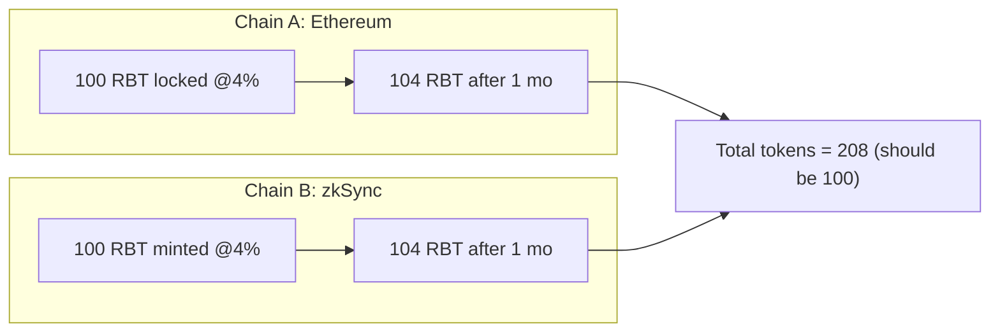
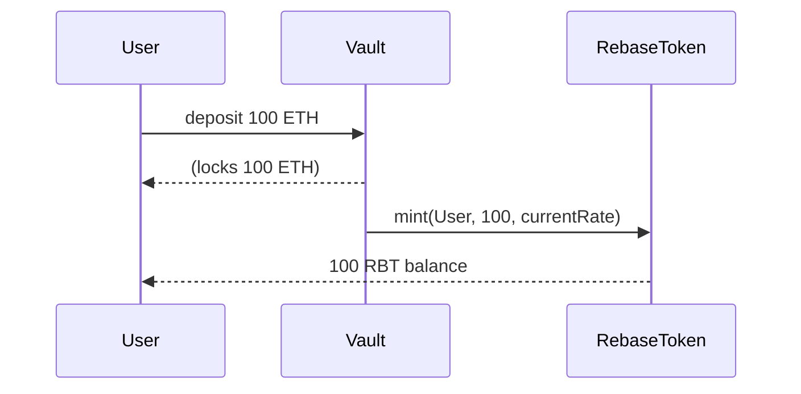
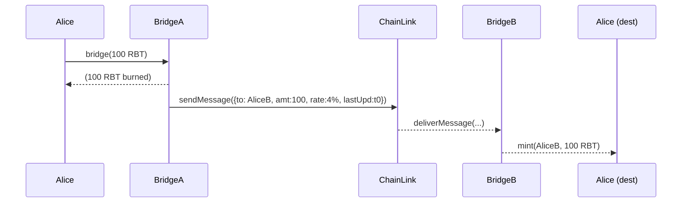

# Executive Summary  
A *rebasing token* automatically adjusts each holder’s balance according to some rule (e.g. earned yield) without transfers. In other words, your balance can grow (or shrink) just by time passing or protocol state changes. This works easily on a single chain: everyone uses the same clock and rules, so total supply and relative shares remain consistent. However, on a **multi-chain system** this creates problems. If a rebasing token can move between chains, each chain might calculate interest independently, leading to **duplicated or lost yield** and inconsistent total supply. 

The key solution is to treat the rebasing token not as a simple number of tokens, but as a *position with state* (principal, interest rate, last-update timestamp, etc.). When bridging, one must transfer not just the token amount but also this metadata. The destination chain then “resumes” the accrual from the correct state, preventing double-counting or missing interest. 

This guide covers the full “journey” of a cross-chain rebasing token: definitions (rebase, lazy/global rebase, index model), deposit and mint flows, bridge lock/burn and mint/unlock flows, required state, examples with numbers, edge cases (rate changes, delays, partial operations), security/economic risks, implementation sketches, testing checklist, common interview questions, and a comparison table of design variants. Diagrams (mermaid flowcharts/sequence diagrams) are included to clarify the concepts.  

# Definitions  

- **Rebase (Rebasing):** A protocol-level operation that changes token supply and individual balances automatically. For example, if a token targets 5% annual yield, a *positive rebase* will mint extra tokens to all holders (increasing each wallet balance proportionally) to reflect accrued yield. Ampleforth-style tokens rebase periodically to target a price, but in our context “rebase” refers to adjusting supply for yield. **Global rebase** refers to doing a single on-chain transaction that updates everyone’s balance at once (e.g. Ampleforth’s daily rebase).  

- **Lazy Rebase:** An alternative implementation where balances are updated “on demand.” Each user has stored data (e.g. principal, interest rate, last-updated time). When they interact with the token contract (transfer, query balance, etc.), the contract **calculates and mints accrued interest at that moment**. The user then sees their increased balance. No global transaction is needed. (In Foundry’s `RebaseToken`, interest is “minted lazily” during user actions.) 

- **Interest-Bearing Token:** A token designed so that its value grows over time (akin to a deposit certificate). This is a kind of rebasing token. Every holder’s balance increases (or, equivalently, the token’s value increases) as yield accrues. For example, in lending protocols like Aave, users deposit ETH and receive an ERC-20 *aToken* that accrues yield. The aToken’s contract continually increases each holder’s balance based on a global interest index. 

- **Index/Exchange-Rate Model:** Instead of updating user balances, some protocols use a global *index* or *exchange rate*. Users hold a fixed-balance token (e.g. Compound’s cToken or Aave’s aToken) and the contract maintains a **liquidity index** that grows over time. A user’s underlying value = balance × index. For example, Aave’s aToken “value is pegged 1:1 to the supplied asset and yield is distributed by continuously increasing their wallet balance”, i.e. via an increasing index. Compound’s cToken similarly uses an exchange rate. Index-model tokens effectively accomplish rebasing (balance grows in value) without adjusting every balance explicitly on each interest event.  

- **Cross-Chain Bridge:** Infrastructure that lets tokens move between blockchains. Typically, a bridge **locks or burns** tokens on the source chain, sends a message, then **mints or unlocks** tokens on the destination chain. (See [Chainlink’s definition](https://chain.link/education-hub/cross-chain-bridge) for bridges.) Common modes include *lock-and-mint* (tokens are locked in a vault/pool on source and new tokens minted on destination) or *burn-and-mint* (burn on source, mint on destination). A bridge often involves an **OnRamp** contract on the source and an **OffRamp** on the destination, coordinated via cross-chain messages (e.g. via Chainlink CCIP).  

- **Vault:** A contract on the canonical chain that holds the underlying asset (e.g. ETH) when a user deposits. The vault mints the rebasing token (e.g. RBT) to the user. This locks collateral and creates the interest-bearing token. In a simple system, the vault might itself continue to earn yield on the collateral (or credit yield to depositors, depending on design). The vault’s held balance and the issued RBT supply must always match (for solvency). The vault is different from the bridge’s token pool, but in many designs the same contract can serve both roles.  

# Cross-Chain Rebase Problem  

On a single chain, rebasing is straightforward: there is one source of truth for time and state, so interest accrues consistently. Cross-chain, each chain might try to rebase independently. Consider an interest-bearing token with 4% annual interest. Suppose Alice bridges 100 tokens from **Ethereum** to **zkSync**. After 30 days:  
- On Ethereum’s vault (where the 100 were locked), interest accrues to 104 (if interest doesn’t stop when locked).  
- On zkSync, Alice’s balance is still 100 (zkSync has no idea interest accrued on Ethereum).  

Now if Alice bridges back at 30 days:  
- If we naively burn Alice’s 100 on zkSync and unlock 100 on Ethereum, Alice loses 4 tokens of interest.  
- If zkSync had also “rebased” its copy to 104, Alice would burn 104 on zkSync and try to unlock 104 on Ethereum – but Ethereum only has 104 locked. This double-counts interest (total supply became 208 across chains while only 100 was original).  

Either way, without coordination the **total supply and user balances diverge** across chains. The missing piece is *state*: to compute interest correctly, the destination chain must know how much principal and what interest-rate/timestamp history the tokens carry. Otherwise, different chains will “invent” mismatched yield.  

Figure:  *Cross-chain rebasing mismatch.*  Both chains independently try to grow 100 by 4%. Each ends up with 104, yielding 208 total – clearly wrong, since only 100 RBT existed.  



The **fundamental issue** is that *rebasing depends on time and rate*, and time flows everywhere. If each chain uses its own clock or accrual formula independently, the two computations won’t match. We need to carry over the full interest state with the tokens.

# Rebase Designs  

Different protocols handle rebasing or interest-bearing tokens in different ways. Below are common models:

- **Global Rebase (Elastic Supply):** A designated function (or automated contract) periodically adjusts all balances. Example: Ampleforth’s daily rebase adjusts each wallet so total supply changes according to price deviation. After a rebase, each holder’s balance changes by the same percentage. *Pros:* Simple concept, all balances stay proportional. *Cons:* Must call a rebase function on schedule, inefficiency for large holder sets, difficult to integrate with transfers (special contract logic needed). Hard to bridge because balances change globally. *Bridge-friendliness:* Poor. If a token on chain A rebases daily, and it’s held on chain B via a wrapper, the wrapper must account for daily supply changes on A to adjust B's supply – a non-trivial sync problem.

- **Lazy Rebase (Per-user tracking):** The contract stores each user’s *principal* (initial deposit) and parameters (interest rate, last-updated timestamp). No global rebase call is needed. Instead, whenever a user interacts, the contract calculates the accrued interest since `lastUpdated` and mints new tokens for that user. The Foundry example uses linear interest: 
  ```
  accrued = principal * (PRECISION + rate * (now - lastUpdated)) / PRECISION – principal;
  ```
  This interest is minted when needed. *Pros:* Efficient (no big loop, interest is computed on user activity), easy to reason per-user, useful for heterogenous rates. *Cons:* Slightly more complex storage (per-user data), can lead to “ghost” interest accrual (if user never transacts, interest isn’t realized until next action). *Bridge-friendliness:* Good, because we can pass the user’s state (principal, rate, timestamp) across chains so accrual remains consistent.

- **Index / Exchange-Rate Model:** Users hold a fixed-balance token (like a share). The protocol maintains a global *index* that increases over time. A user’s claim = balance × index. For example, Aave’s aTokens automatically grow in balance via an internal global liquidity index. As Aave docs explain, “All yield collected by the aTokens’ reserves are distributed to holders by continuously increasing their wallet balance.” The `balanceOf(user)` reads the current balance = principal × current index. Compound’s cTokens use an analogous exchange rate formula. *Pros:* No per-user accrual needed in code; interest is implicit via a number. *Cons:* If you move users between chains, you must transfer or synchronize the global index (or some representation of accrued reward). *Bridge-friendliness:* Moderate. The bridge must include the current index (or equivalent) and perhaps user’s previous share so the other chain can compute correct balances. This is doable but requires care.

- **Non-Rebasing Wrapper (Share Token):** Some protocols create two tokens: one that accrues and one fixed-balance “share” token. For example, Lido’s stETH is actually rebasing (ETH balance increases over time), but Lido also issues wstETH, which is a fixed-balance token whose *exchange rate* to ETH increases. Bridging often uses the non-rebasing token (wstETH) to avoid dealing with frequent balance changes. *Pros:* Bridges easily (fixed balance token behaves like index model). *Cons:* Users may hold a “wrapper” that requires unwinding to get raw interest-bearing token. Complexity in design and user understanding. *Bridge-friendliness:* Good (since wrapped token doesn’t rebase).

- **Canonical Chain Only (Single-Chain Rebase):** One chain (say Ethereum) is canonical for supply and rebase, other chains only hold *wrapped placeholders*. For example, Aave’s cross-chain strategy for GHO used a source-of-truth design: one chain’s TokenPool locks the real tokens, other chains mint “facilitator” tokens that are backed 1:1. Other chains do not run their own rebase or interest; they rely on the canonical chain. *Pros:* Simplest for consistency (no double counting). *Cons:* Requires always locking/unlocking on one chain; cross-chain transfers are one-way (no simultaneous yield accrual). Not truly multi-chain yield. *Bridge-friendliness:* Excellent for safety, but yield only accrues when tokens are on the canonical chain.

The table at the end summarizes these designs (Global, Lazy, Index, Wrapped, Canonical).

# Required State for Cross-Chain Bridging  

To preserve interest accrual, a bridge must transfer *enough information* about the user’s position. Simply sending `amount` is not enough. Key pieces include:

- **Principal (or amount):** How many tokens the user originally had (or last synced amount). If interest has accrued, the “principal” might mean pre-interest amount (depending on design).  
- **Interest Rate or Index:** In per-user models, each user may have a specific interest rate (s_userInterestRate) captured at deposit. This must travel with the tokens. In index-model tokens, the current global index or exchange-rate at the moment of bridge must be sent. Essentially, the destination chain needs the same “growth factor” state.  
- **Last-Updated Timestamp:** For lazy rebase tokens that accrue linearly over time, the timestamp of last accrual is needed so the destination can continue from the correct point.  
- **Total Supply / Vault Balance:** The canonical total supply or the vault’s locked balance on the source chain might also be relevant to maintain accounting consistency, especially if bridging back and forth. However, typically the bridge’s token pool contract on each side keeps track of locked vs minted amounts, so global total-supply info is not always transferred each time.  

In the Foundry cross-chain design, the bridge’s **TokenPool** message includes `(principal, userInterestRate, lastUpdated)` as payload. On the destination, the `releaseOrMint(...)` function decodes this and calls the token contract’s `mint(to, principal, userInterestRate)`. This ensures the user’s rate and timestamp continue seamlessly on the other side. 

Example:  
- Source chain (Ethereum) payload: 
  ```
  principal = 100 RBT
  userRate = 4% per year
  lastUpdated = t0
  ```  
- Destination (zkSync) receives and does:  
  `mint(alice, 100, 4%)` with timestamp t0.  

Now zkSync knows Alice’s 100 RBT has 4% rate and last updated t0, so if Alice checks balance at t0+30d, the contract can compute 104, matching Ethereum’s accrual.

# Deposit and Mint Flow (Single-Chain)  

As background, the typical user flow *on one chain* to create interest-bearing tokens is:

1. **User deposits underlying asset (e.g. ETH)** into a Vault contract.  
2. The Vault **locks** the ETH. It may send the ETH to a lending protocol (e.g. Aave, Compound) or hold it itself.  
3. The Vault (or a linked RebaseToken contract) **mints** the corresponding rebasing token (e.g. RBT) 1:1 to the depositor.  
4. The Vault updates its records (and the RBT’s ledger) accordingly. Now the user has RBT which will accrue yield.  



Over time, the RebaseToken’s logic will increase `User`’s balance. For a **lazy rebase** model, it might store `principal=100`, `rate=currentRate`, `lastUpdated=depositTime`. On future calls (transfer or balance query), the contract mints interest from these. In a **global rebase** model, some external keeper may call `rebase()` every so often, which loops through holders and adjusts balances. In an **index model**, the contract maintains a global index; the user’s RBT balance stays at 100 but its implied ETH value grows.

# Bridging Flow (Lock/Burn & Mint/Release)  

When moving tokens between chains, we typically have two contracts (or two instances): one on each chain (say Chain A and Chain B). We’ll call them **TokenPoolA** (on Ethereum) and **TokenPoolB** (on zkSync). There is also a router or handler that relays messages (e.g. Chainlink CCIP).

- **On Source Chain (Ethereum):** The user calls `bridgeToOtherChain(amount)`.  
  - The TokenPoolA’s `lockOrBurn()` is invoked. If the token is mintable on both sides, it might *burn* the user’s tokens. If one side is canonical, it might *lock* them. In either case, the tokens leave the user’s balance in Chain A.  
  - The contract gathers the user’s state (`principal=amount`, `userRate`, `lastUpdated`, etc.) and emits a cross-chain message payload containing these.  
  - Example: Alice has 100 RBT at 4%. She calls `bridge.lockOrBurn(alice, 100)`. The pool burns 100 RBT. It then sends:  
    ```
    payload = { to: alice, amount: 100, userRate: 4%, lastUpdated: <t> }
    ```  

- **Cross-Chain Messaging:** The bridge infrastructure transmits this payload to the destination chain. In Chainlink CCIP, an off-chain network of oracles delivers this to the destination Router/OffRamp. 

- **On Destination Chain (zkSync):** The bridge’s `releaseOrMint()` is called upon message arrival.  
  - It decodes the payload: `{ to, amount, userRate, lastUpdated }`.  
  - It calls the token contract’s mint function: `mint(to, amount, userRate, lastUpdated)`. This creates `amount` tokens on Chain B for the user, and initializes their interest state to match Chain A.  
  - Now the user has the same economic position on Chain B as they had on Chain A.  



Once minted on zkSync, those 100 RBT start accruing interest at 4% per year from time `t0` onward. The original 100 on Ethereum are gone (burned/locked in the vault), so total supply remains correct. 

**Diagram:** Cross-chain flow (Ethereum → zkSync) with per-user rate transferred.

```mermaid
flowchart LR
    Ethereum((Ethereum)) -->|lock/burn 100 RBT| TokenPoolE[TokenPool A] 
    TokenPoolE --> CCIP{"CCIP message:\namount=100,\nrate=4%, t0"} 
    CCIP --> TokenPoolZ[TokenPool B (dest)] 
    TokenPoolZ -->|mint 100 RBT| zkSync((zkSync))
```

If Alice later bridges back, the reverse happens: BridgeB burns Alice’s 100 on zkSync, sends a message back to BridgeA with the state, and BridgeA unlocks or mints 100 (plus any interest if the design allows) on Ethereum. Crucially, the rate/timestamp is also sent back, so Ethereum can correctly redeem her position.

# Deposit→Mint RBT Flow (with Vault)  

Let’s detail the *initial* deposit scenario, since it was also asked:

Suppose *Ethereum* is the original chain for the token. A user Alice deposits 100 ETH into a Vault contract to start earning interest. The sequence is:

1. Alice calls `vault.deposit({ value: 100 ether })`.  
2. The Vault receives 100 ETH and records it.  
3. The Vault calls `token.mint(alice, 100, currentGlobalRate)` on the RBT token contract. (The token contract may record `s_userInterestRate[alice] = currentGlobalRate` and `s_userLastUpdated[alice] = now`.)  
4. Alice’s wallet now shows **100 RBT**. Behind the scenes, the Vault’s ETH balance is 100, and total RBT supply is 100.  

Over time on Ethereum, Alice’s RBT balance will grow according to the interest model. If Alice never moves her tokens, she could wait and then call `vault.redeem(amount)` to burn some RBT and receive back ETH (plus interest). The burn function would use the accumulated interest to determine how much ETH to return.

Nothing to do with zkSync yet. This is just the single-chain rebase lifecycle.

# Examples with Numbers and Timelines  

1. **Basic Accrual (One Chain):** Alice deposits 100. Interest is 4% APR. After 1 year (365 days):  
   - Global rebase style: If a rebase occurs yearly, a keeper calls `rebase()`, and Alice’s balance becomes 104. (She automatically has 104 RBT.)  
   - Lazy rebase style: Alice’s lastUpdated=Jan1, principal=100, rate=4%. On Dec31, she checks `balanceOf()`. The contract computes interest:  
     ```
     delta = 100 * (1 + 0.04 * 365d/365d) - 100 = 4.
     ```
     So her effective balance becomes 104. The contract mints 4 to her.  
   Either way, the result is 104 RBT, which can be redeemed for 104 ETH (minus any fees).

2. **Cross-Chain Bridge (Simple):** Alice has 100 RBT on Ethereum (4% rate). On Jan1, she bridges all 100 to zkSync. The bridge message includes (100, 4%, t0=Jan1).  
   - Ethereum: 100 burned/locked, leaving vault with 100.  
   - zkSync: 100 minted to Alice with rate=4%.  

   Now 30 days pass. Ethereum vault grows (if interest accrues while locked) to 101 (approx). Alice’s balance on zkSync grows to about 101.  
   On Feb1, Alice bridges back 100 RBT from zkSync. The bridge sends (100, 4%, Jan1) back. Ethereum vault sees 100 principal, 4% since Jan1, and could mint ~101 (depending on contract). Thus Alice ends up with her position consistent. No free money was made or lost.

3. **Incorrect Outcome (Double Counting):** Suppose we did **not** send the rate, and just bridged 100 plain tokens twice.  
   - Jan1: Bridge 100 to zkSync (no interest data).  
   - 30 days: Ethereum vault has 104, zkSync side rebase (mistakenly) also does +4 to 104. Total 208.  
   - Alice bridges 104 back; Ethereum gives her 104. Now total supply shown = 208 down to 104 (still off). This clearly creates inflation.

4. **Rate Change Edge:** Suppose the token’s global rate can change (e.g. protocol admin lowers rate). Example: Alice deposited when rate was 5%, but after a month the protocol changed the rate to 2%. If Alice bridges mid-month, we must be careful: we should carry the *old rate (5%)* for the first 30 days, not retroactively apply 2%. The destination chain needs to know which rate applied during which interval. In the lazy model, the user’s stored `userRate` may remain 5% until fully accrued, and then update to 2% for future accrual. All of this state (old rate, new rate, rate-change timestamp) would have to be conveyed or inferable. The Foundry design keeps a single `s_userInterestRate` that only changes at deposit or first transfer; if global rate can only *decrease*, they require that in code to prevent retroactive inflation. If multiple chains might change rates independently, bridging is trickier – one chain’s new rate should only start after messages confirm rates, etc.

5. **Multiple-Chain Relay:** Alice moves tokens from Ethereum → zkSync → Arbitrum. At each hop, interest can accrue. Each bridge step must carry forward the full state. If there is a delay, e.g. the message from zkSync to Arbitrum arrives late, time between sending and receiving must be accounted for. This often means using block timestamps from the source in the payload and trusting that the destination time is close enough. Oracle attacks (see Risks below) can come into play if a malicious validator skews timestamps.

# Edge Cases  

- **Interest Rate Changes:** If the protocol’s interest rate changes (especially unpredictably), the bridge must handle it carefully. In per-user models, each user keeps the rate in effect at deposit. If rate drops, new deposits get new rate; old deposits keep old rate. If a user bridges across a rate change without updated logic, discrepancies arise. A robust design either forbids rate changes (immutable) or encodes rate history in the user’s state.  

- **Delayed/Out-of-Order Messages:** Cross-chain messages are asynchronous. It’s possible (rarely) for two bridging operations to cross paths. For example, Alice bridges 100 to zkSync, then immediately bridges back 100 from zkSync to Ethereum before the first message is finalized on Ethereum. Proper handling requires the bridge to sequence these calls or revert one if the state is already changed. Race conditions must be handled in the contract or by atomic message ordering in the protocol.  

- **Partial Withdrawals:** If Alice tries to withdraw (redeem) only part of her position on one chain while some of her balance is bridged to another chain, bookkeeping gets complex. The bridge design typically ties up the entire portion being moved. Any partial redemption would involve burning some RBT (triggering interest update) and unlocking ETH from the vault. If only part is moved, the token state left behind still accrues interest. The protocol must ensure total balances plus vault collaterals always match across all chains.  

- **Wrapped vs Canonical Tokens:** Some tokens have canonical “real” versions (like ETH or USDC) and cross-chain “wrapped” versions. If the underlying protocol distributes yield (e.g. staking ETH yields staking rewards), bridging ETH vs bridging an ETH-yield token has different effects. Native ETH doesn’t auto-yield by itself, but many rebasing designs assume an underlying vault that *does* yield. For ERC20 tokens, similar issues arise: bridging a raw token vs bridging its interest-bearing derivative. As an example, Lido’s stETH (rebasing) is seldom bridged directly; instead, Lido offers wstETH (wrapped stETH), which is non-rebasing, and bridges that. This avoids rebase complications at the bridging layer.  

- **Multiple Bridges (Multiple Chains):** If a token exists on 3+ chains, keeping them all in sync is harder. Ideally, treat one as canonical (only it actually accrues or rebase) and others as “facilitator” chains. For true multi-deposit use-cases, one could design a mesh of message flows, but normally protocols use a hub (L1) and spoke (L2s) model.

- **Native ETH vs ERC-20:** Native ETH needs special handling (bridges often wrap it as WETH). An interest-bearing ETH token must be an ERC-20 anyway (you can’t rebase the native coin). But remember, if you lock native ETH and mint a token, the interest on that token comes from lending the ETH. If bridging a rebasing ETH-token, ensure the vault logic is compatible with how ETH is locked (e.g. using WETH or native via special bridge contracts).

# Security & Economic Risks  

1. **Double Counting / Inflation:** As discussed, unsynchronized rebases can inflate supply. If two chains both mint interest on the same underlying collateral, the total supply explodes, undermining the peg or solvency. A malicious user could exploit this to mint “free” tokens by bridging between chains with different rebase states.  

2. **Under-Collateralization:** Conversely, if the bridge releases more tokens than locked collateral, the protocol is under-collateralized. For example, if interest accrues on locked ETH but the bridge unlocks more RBT than ETH available, the vault can’t honor withdrawals. This could happen if a chain’s bridge logic mistakenly assumes interest-less locking or if rate/state data is lost.  

3. **Oracle/Timestamp Attacks:** If the protocol uses block timestamps to compute interest, a miner could manipulate `block.timestamp` (within ~900 seconds) to slightly increase interest on one chain before bridging, then manipulate on the other chain differently. Over many blocks, these small skews could accumulate into extra yield. Strict protocols may restrict timestamp adjustments (via bounded difference checks) or use more deterministic accrual.  

4. **Griefing / Spam:** A user might repeatedly bridge small amounts back and forth to trigger interest differently. For example, bridging right before a high-interest period or rebase could gamify timing. Rate-limiters and “reentrancy guards” in bridge pools usually mitigate this.  

5. **Cross-Chain Consensus Failures:** If the underlying bridge network is compromised (e.g. CCIP or the relayers are attacked), false messages could be delivered. For instance, a malicious message could mint tokens without a real burn, or vice versa. Bridges often use multi-sig or consensus validations and rate limits to guard against this.  

6. **Economic Misalignment:** If the interest rate differs significantly across chains (e.g. one chain caps yield, another allows more), arbitrage will push everyone to one side. The design must either enforce a single rate (through governance) or be prepared for imbalances.  

7. **Smart Contract Vulnerabilities:** Any complicated state transfer (e.g. packing principal/rate/timestamp into bytes) risks bugs. For example, the Foundry code had to carefully handle mint and burn roles. If a bridge contract has a flaw (as with many bridges in DeFi history), funds can be stolen. 

# Implementation Patterns (Pseudo-code)  

Below is sketch of key parts in a **lazy rebase token with cross-chain bridge**. This is inspired by the Foundry `RebaseToken.sol` and Bridge contracts, but simplified:

```solidity
contract RebaseToken is ERC20 {
    mapping(address => uint256) public principal;          // original deposited amount
    mapping(address => uint256) public userRate;          // per-user interest rate (fixed on deposit/first receive)
    mapping(address => uint256) public lastUpdated;       // timestamp of last interest accrual

    // Mint (only callable by vault/bridge)
    function mint(address to, uint256 amount, uint256 rate) external onlyMinter {
        _mintAccruedInterest(to);     // bring 'to' up to date
        _mint(to, amount);
        if (principal[to] == 0) {
            // first time this user gets tokens, set their rate
            userRate[to] = rate;  
        }
        lastUpdated[to] = block.timestamp;
        principal[to] += amount;
    }
    // Burn (only callable by vault/bridge)
    function burn(address from, uint256 amount) external onlyBurner {
        _mintAccruedInterest(from);
        _burn(from, amount);
        lastUpdated[from] = block.timestamp;
        principal[from] -= amount;
    }
    // Internal: mint accrued interest for user
    function _mintAccruedInterest(address user) internal {
        uint256 timeDelta = block.timestamp - lastUpdated[user];
        if (timeDelta > 0) {
            uint256 rate = userRate[user];   // e.g. 400 => 4% per year scaled
            uint256 interest = principal[user] * rate * timeDelta / YEAR / SCALING;
            if (interest > 0) {
                _mint(user, interest);
                principal[user] += interest;
            }
            lastUpdated[user] = block.timestamp;
        }
    }
}
```

```solidity
// Bridge TokenPool (CCIP integration style)
contract RebaseTokenPool is TokenPool { 
    // Source chain: locks/burns user tokens
    function lockOrBurn(address user, uint256 amount) external override {
        token.burn(user, amount);     // burn on source
        // encode and return user interest state
        return abi.encode(userRate[user], lastUpdated[user]);
    }
    // Destination chain: unlocks/mints tokens for user
    function releaseOrMint(address user, uint256 amount, bytes memory data) external override {
        (uint256 rate, uint256 lastT) = abi.decode(data);
        token.mint(user, amount, rate);
        token.setLastUpdated(user, lastT);
    }
}
```

These simplified snippets show the idea: store per-user state, accrue lazily, and pass it through the bridge payload. In practice, careful checks and roles (`onlyMinter`, `onlyBurner`) are needed.  

# Testing Checklist  

When testing a cross-chain rebasing token, consider:  
- **Accrual Accuracy:** On one chain, deposit and wait various intervals; check that balances match expected interest for various durations and rate changes.  
- **Transfer Updates Rate:** When transferring tokens to a new address, ensure the recipient inherits the right interest rate (if new) and the sender’s balance is updated. (The Foundry design copies `userRate` to the recipient if first-time holder.)  
- **Bridge Forward Flow:** Bridge tokens from Chain A→B: after message, check the user’s balance on B and remaining locked balance on A. Verify user on B accrues interest correctly from the original timestamp.  
- **Bridge Round-Trip:** Bridge A→B and then B→A (with interest in between). The final balance on A should equal what it would have been if Alice had never left (minus any bridging delays). No net gain.  
- **Edge of Rate Change:** Change the global rate in the protocol, then try bridging positions opened before/after the change. Ensure old positions keep old rates.  
- **Delayed/Replay Messages:** Simulate delays in cross-chain messages. Try replaying an old message or sending out-of-order; the contract should reject or properly handle them (preventing double mint).  
- **Partial Operations:** If supporting partial withdraw on one chain while some funds are bridged, simulate that. Ensure sums of balances and vault collateral remain consistent.  
- **Multi-Chain (N-chain) Scenarios:** Bridge A→B→C and back in loops. Ensure interest is never counted twice.  
- **Security Checks:** Rate-limit bridges (max tokens per message), verify roles for mint/burn, protect against integer overflow in interest calc, etc.  
- **Gas Costs:** Check gas usage for large principal, heavy usage.  

# Common Interview Questions (with concise answers)  

1. **What is a rebasing token?**  
   A rebasing token is one whose supply adjusts automatically, so each holder’s balance can change without transfers. This is used for price-pegged or yield-bearing tokens. A positive rebase adds tokens to wallets; a negative rebase removes tokens, all proportionally.  

2. **Difference between global and lazy rebase?**  
   *Global rebase* means running a contract function that loops through all users and adjusts balances (like Ampleforth’s daily rebase). *Lazy rebase* means each user’s balance is updated on-demand during interactions. Instead of a global call, the contract calculates accrued interest when a user does a transfer or balance query.  

3. **What is an index-based interest token?**  
   This is where each token’s value increases via a global index (exchange rate) rather than adjusting balances. Example: Compound’s cTokens or Aave’s aTokens; your balance is fixed but redeem value grows. The contract maintains a liquidity index that grows with interest.  

4. **Why is cross-chain bridging tricky for rebasing tokens?**  
   Because time and interest accrual need to be synced across chains. If each chain rebases independently, one position could earn double (on each chain) or none (if on the other chain). You must transfer the user’s accrual state to avoid mismatches.  

5. **What data needs to be sent when bridging?**  
   At minimum: the principal amount, the user’s interest rate (or some representation of accrued interest), and the last-updated timestamp. Possibly total supply or vault balances if the protocol requires it. This ensures the destination chain can continue accrual from the correct point. The Foundry solution sends `(principal, userRate, lastUpdated)` with the bridge message.  

6. **Example of incorrect outcome?**  
   If a bridge only moved token amount 100 and ignored rates, each chain could credit 4 interest (for 4% APR). Then user bridges back and gets too many tokens. In numbers: user bridges 100 @4%, each side gets +4 to 104. If user bridges back 104 and receives 104 (when 104 was locked), she made 4 tokens extra for nothing. That’s double-counting interest.  

7. **What are wrapped vs canonical tokens in this context?**  
   A “canonical” token might be the original on chain A, and “wrapped” copies exist on chain B. For rebasing tokens, usually only the canonical token actually accrues. Wrapped copies on other chains just mirror it. For example, Lido’s stETH (rebasing) is canonical, and wstETH (wrapped) is non-rebasing. They bridge wstETH because it avoids rebase issues.  

8. **How to handle rate changes?**  
   If protocol’s rate changes (e.g. from 5% to 2%), you must decide: do existing positions keep old rate? In Foundry, userRate is captured on deposit and never increases; it can only decrease by admin action. If bridging during a change, the bridge message should include either the old rate or any new rate along with a timestamp so accrual is segmented correctly.  

9. **Could a miner manipulate interest via timestamps?**  
   Potentially yes. If accrual depends on `block.timestamp`, a miner can pick a later timestamp to artificially increase `timeElapsed`. Over many blocks, this can inflate interest. Mitigation: clamp timestamp drift, or use a fixed block duration assumption.  

10. **Why burn on one chain and mint on the other?**  
   Burning/locking ensures total supply stays correct. If we didn’t burn on source, tokens would exist twice. Typical bridges use *burn-and-mint* (tokens are burned on source, minted on dest) or *lock-and-mint* (locked in a vault on source, minted on dest).  

11. **What if a bridge message fails?**  
   If the cross-chain message never arrives (e.g. due to network hiccup), the tokens are locked/burned on source but not unlocked on dest. A good bridge either retries or provides a refund mechanism after timeout. Testing should include simulating message failure and recovery.  

12. **How to avoid losing interest while tokens are “in flight”?**  
   Usually, we assume interest does *not* accrue during the brief bridging delay, or that it’s negligible. The safe approach is to use the source timestamp as the accrual point (as Foundry does) so neither side counts interest for the crossing period.  

13. **What is griefing in this context?**  
   A user might repeatedly bridge back and forth to game the interest calculation. For example, bridging right before and after a rate change. Good bridge design limits how often one can cross chains or requires time locks.  

14. **How do aTokens (Aave) handle cross-chain?**  
   Aave’s aTokens rely on a global liquidity index. If you tried to bridge aTokens, you would also need to transfer that index (or equivalently, calculate and send the user’s underlying balance). Alternatively, Aave could treat aTokens as non-bridgable and instead bridge the underlying asset plus mint new aTokens.  

15. **Why do some designs use a single “canonical” chain for accrual?**  
   To avoid the problems entirely. If only Chain A does interest and Chains B/C just hold placeholders (no accrual), then you never double-count. It simplifies security at the cost of less flexibility.  

*(More questions can include variations on these themes, but these 15 cover the core concepts.)*  

# Design Comparison Table  

| Design                   | State Transferred                   | Pros                                     | Cons                                        | Complexity | Bridge-Friendly |
|--------------------------|-------------------------------------|------------------------------------------|---------------------------------------------|------------|-----------------|
| **Global Rebase**        | None (just amounts)                 | Simple concept; proportional balances.   | Needs global rebase calls; hard to sync.    | Low        | ❌ Poor          |
| **Lazy Rebase**          | Principal, rate, lastUpdated        | Accurate per-user accrual; no loop.      | More storage; must pass state metadata.     | Medium     | ✅ Good         |
| **Index Model (aToken)** | User balance + global index         | No per-user math; simple accounting.     | Must sync index; user index history.        | Medium     | ⚠️ Fair (needs data) |
| **Non-Rebasing Wrapper** | Underlying balance + index          | Bridges like normal token; safe.         | Requires wrapper semantics; UX cost.        | Low        | ✅ Good         |
| **Canonical-Only**       | Just amounts (no yield cross-chain) | Very secure; simple bridge logic.        | Yield only accrues on one chain; limited.   | Low        | ✅ Excellent    |

*Legend:* Complexity refers to contract complexity. Bridge-Friendly means how easily the design can be bridged without special measures. (For global rebase, bridging is very difficult; for canonical-only or non-rebasing, trivial.)  

# Suggested Diagrams  

- **User Journey Flowchart:** Deposit ETH → Receive RBT → Interest accrual → Bridge → Interest accrual on new chain (done above in text and mermaid).  
- **Sequence Diagram:** (Mermaid above) showing calls between Alice, Vault, BridgeA, cross-chain router, BridgeB.  
- **State Diagram:** Illustrate user state (principal + rate + timestamp) flowing from one chain to another.  
- **Timeline Chart:** Show a timeline of events (deposit at t0, rate change at t1, bridge at t2, accrual on chain B, bridge back at t3) to visualize rate-change effects.  
*(Mermaid or similar could be used for these; for brevity, code samples above focus on sequence and flow charts.)*  

# References  

- Chainlink Cross-Chain (CCIP) docs (TokenPool lock/burn → mint/unlock mechanism).  
- Aave aToken documentation (interest by increasing balance).  
- Bitfinex/Ampleforth (AMPL) help (rebase changes user balances daily).  
- Axelar Blog (Lido stETH vs wstETH bridging note).  
- Foundry Cross-Chain Rebase Token (RebaseToken.sol, bridging design).  

